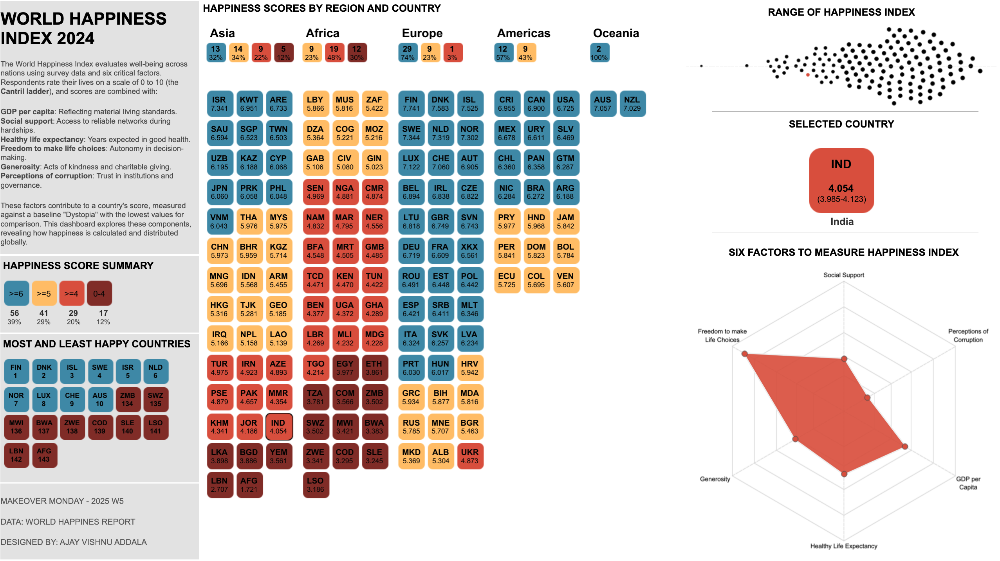

# World Happiness Index Dashboard

This project explores the **World Happiness Index**, which ranks countries based on various factors that contribute to overall well-being. The dashboard, built in Tableau, provides an interactive visualization of the latest rankings, factors, and insights into global happiness trends.

---

## Overview
The World Happiness Index is calculated using survey responses and six critical factors:
- **GDP per capita**: Reflects economic prosperity.
- **Social support**: Measures the strength of social networks.
- **Healthy life expectancy**: Indicates average healthy years of life.
- **Freedom to make life choices**: Highlights personal autonomy.
- **Generosity**: Based on charitable acts and kindness.
- **Perceptions of corruption**: Captures trust in government and institutions.

The final happiness score combines these factors to provide a comprehensive view of happiness across nations.

---

## Files Included
1. **Tableau Dashboard**: [World_Happiness_Index](https://public.tableau.com/app/profile/ajay.vishnu.addala/viz/WORLDHAPPINESSINDEX2024MOM2025W5/MOM2025-W5#1)  
   *(Click to download the Tableau file)*

2. **Dataset**: `world_happiness_data.csv`  
   *(Contains the raw data used to create the dashboard)*

3. **Snapshot**:   
   *(Preview of the Tableau dashboard)*

---

## How to Use
1. Download the Tableau file from the link above.
2. Open the file in Tableau Desktop.
3. Explore the interactive dashboard to analyze global happiness trends.

---

## Insights
The dashboard provides:
- A country-wise ranking of happiness scores.
- Breakdown of the six factors contributing to happiness.
- Regional comparisons and trends in well-being.

---

## License
This project is licensed under the MIT License. Feel free to use and modify the content with attribution.

---

## Acknowledgments
- Data Source: [Gallup World Poll](https://www.gallup.com/analytics/232838/world-poll.aspx)
- Visualization: Created using Tableau

---

Enjoy exploring global happiness trends!
